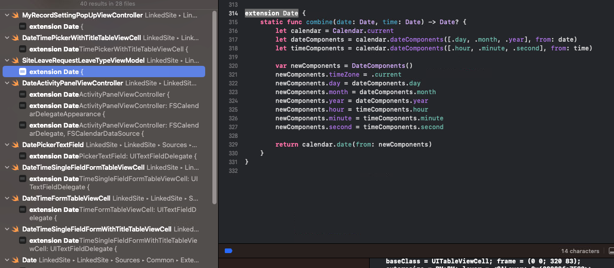
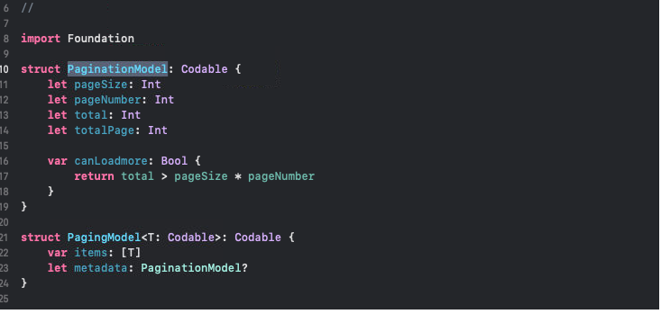
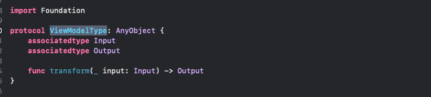
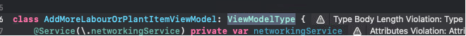
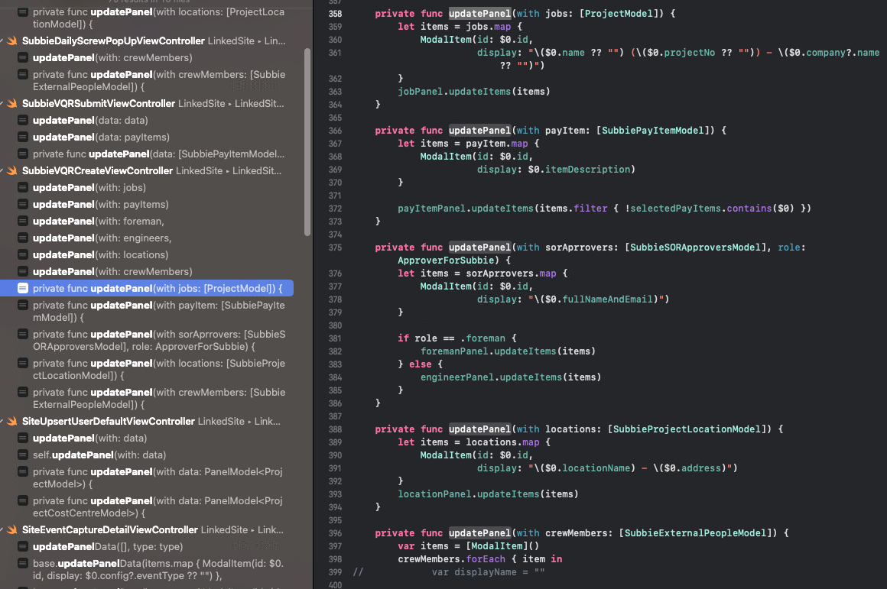

# iOS-ISSUE

-------
### Issue 1 - Extension file
>Có những file extension tạo sẵn cho từng UIkit,...nhưng mà vẫn có những trường hợp là mình tiện 
    tay extension vào cái VC && VM chứ không extension vào file đã tạo sẵn

- Thuận lợi: `tiện nhanh`
- Bất lợi: Có thể `khó check trùng logic`

=> Dời những cái extension ở những file rải rác để vào đúng file extension của nó

----
### Issue 2 - Paging
> Có quá nhiều thể loại paging trong source code:
    
    
    
- Map model app

      Pagination Model  

    + Thuận lợi: Nó có thể `giữ cả thông tin về pageSize,.. và giữ cả items` trong đó, có tính thống nhất cao nếu viết hàm để checkCanLoadMore, tính pageSize chung, `Thống nhất pageSize` toàn app
    + Khó khăn: Cần `phải xử lý` trước khi có thẻ gửi lên server

- From server
    
        Subbie.Pagination
        Site.Pagination

        
        
        
    + Thuận lợi: nó `dùng type của server` nên có thể gửi trực tiếp khi call api
    + Bất lợi: Tạo thêm biến để chứ item riêng, checkLoadMore và tính pageSize thì mỗi file một xử lý(có thể tham khảo trong source code) => `Không có tính thống nhất` và `khó maintain`

    => Nên lựa chọn PaginationModel và custom lại để dùng chung

    

### Issue 3 - ViewModel

> Trong phạm vi module, có những màn hình cần dùng lại 1 sô logic call api cũng như là 1 sô logic chung cần xử lý. Nhưng app thì chưa có nơi nào để đặt chung được

Giải pháp:
    
    Ở app hiện tại các viewModel đang kế thừa protocal ViewModelType

    Tạo một class tên module_ViewModel -> module_ViewModel sẽ kế thừa ViewModelType (Tham khảo VQR module)

- Thuận lợi:
    - Chỉ cần định nghĩa 1 lần: `api dùng ở nhiều màn hình`, `field dùng lại ở nhiều màn hình` chỉ cần định nghĩ ở viewModel mới tạo
    - Và có thể tái sử dụng lại các định nghĩa hàm call api thay vì phải define từng file như cách cũ
    - Gọn code

### Issue 4 - Other issue
- Code convention

    > `String` vẫn còn bind thẳng ở viewcontroller
    - Quy định `số lượng từ` nếu vượt quá thì cần phải bỏ vào localizable 

    > Có những cái Constant không nên dùng kiểu string để biểu diễn nó

    - ví dụ như: status của các module trong Subbie app: Docket Started,...
    - Cần định nghĩa ra `enum`: để dùng chung, đỡ bị gõ nhầm trong quá trình code string

    > GenericType là một công cụ tốt để có thể xử lý nhiều kiểu dữ liệu nhất

    - Nên tìm hiểu để áp dụng nhiều hơn để tránh hiện tượng lặp code như ảnh dưới đây, hoặc chia nhỏ hàm để xử lý

    

    > Có những hiện tượng magic number

    - Với những `con số gây khó hiểu` trong source code thì nên đặt biến trước khi sử dụng

    > Filter trực tiếp trong closer var xử lý trược tiếp ở trong hàm do {} rxswift

     - Quy định ra số lượng điều kiện (đối với `filter`), số dòng xử lý cần để tách hàm đối với cách xử lý ở hàm `do,...` trong rxswift

